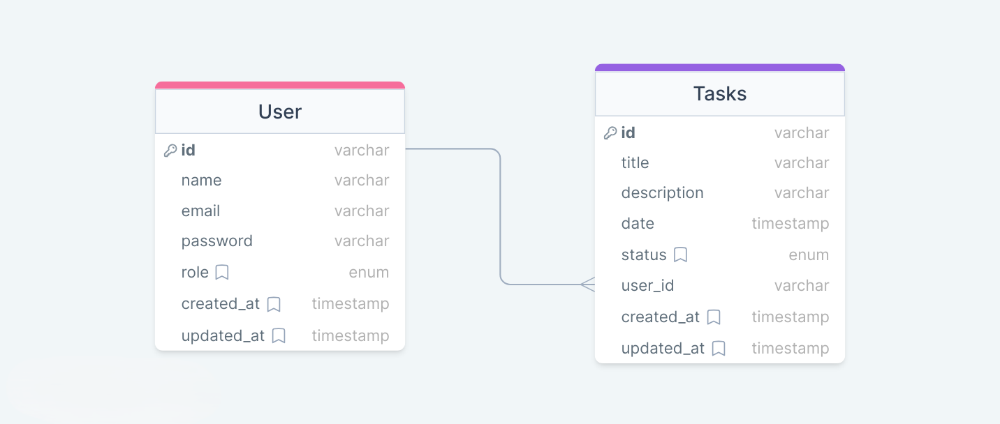

# Task-Manager-API

--

## Entity Relationship Diagram



--

**Descrição:**

O Gerenciador de Tarefas é uma aplicação web full-stack desenvolvida como projeto de conclusão do curso de Desenvolvimento Web do Reprograma Jucás. Esta aplicação permite aos usuários organizar suas tarefas de forma eficiente, oferecendo recursos avançados de gestão e colaboração.

--

## Technologies

- `Node.js`
- `Typescript`
- `Express`
- `JSON Web Token (JWT)`
- `Bcrypt`
- `Sqlite`
- `Zod`

--

## Installation

```bash
# clone project
$ git clone https://github.com/EmanuelQuintino/Task-Manager-API.git

# install dependencies
$ npm install

# run api
$ npm run dev
```

--

## Environment Variables

```ini
PORT=""
SECRET_TOKEN=""
EXPIRESIN_TOKEN=""
KEY_TOKEN=""
```

--

## Endpoints

### Autenticação

- `POST ("/login")`: Inicia a sessão do usuário.
- `POST ("/logout")`: Encerra a sessão do usuário.

### Usuário

- `GET ("/user")`: Retorna informações do usuário.
- `POST ("/user")`: Cria um novo usuário.

### Tarefas

- `POST ("/task")`: Adiciona uma nova tarefa.
- `GET ("/tasks")`: Retorna todas as tarefas.
- `PUT ("/task/:id")`: Atualiza uma tarefa existente.
- `DELETE ("/task/:id")`: Remove uma tarefa existente.

## Paginação

- Parâmetros:
  - `limit`: Número de itens por página.
  - `offset`: Índice de deslocamento.
  - `filter`: Opções de filtro: all | completed | "pending" | "late".

**Exemplo de Uso da Paginação**: `/tasks?limit=4&offset=0&filter=late`

## Links

- [Deploy](https://task-manager-seven-indol.vercel.app/)
- [Client-Side Repository](https://github.com/EmanuelQuintino/Task-Manager)
